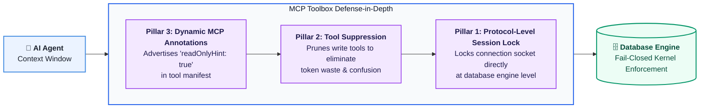

## Overview

When granting autonomous AI agents access to enterprise databases, relying on prompt instructions or application-level string matching is insufficient. Even a minor prompt injection, hallucination, or query misconfiguration can lead to irreversible data loss or unauthorized mutations.

MCP Toolbox implements an end-to-end **Three-Layer Defense-in-Depth Architecture** for read-only database access. Security is enforced at the lowest level (the database engine itself), while performance and token efficiency are optimized at the highest level (the MCP protocol manifest).

Whether you expose **prebuilt servers** where agents generate dynamic SQL or author curated **custom tools** with predefined SQL templates, read-only protection ensures true fail-closed security.

---

## Why "Soft Locks" Fail in Production

Conventional approaches to restricting database tools to read-only operations typically rely on software-level or prompt-level guardrails. In production, these methods fall apart:

1. **Prompt Guardrails & Client Hints:**
   Prompting an agent *"Please only run SELECT queries; never execute DELETE"* treats a probabilistic language model as a deterministic security boundary. Prompt injections, jailbreaks, and adversarial user inputs can easily override system prompt instructions.
2. **Regex & SQL String Parsers:**
   Checking whether a query starts with `SELECT` is easily bypassed. For example, Common Table Expressions (CTEs) such as:
   ```sql
   WITH d AS (DELETE FROM users RETURNING *) SELECT * FROM d;
   ```
   begin with `WITH` and end with `SELECT`, yet still delete data. Furthermore, string parsers cannot detect **User-Defined Functions (UDFs)** or stored procedures: a statement like `SELECT purge_inactive_records();` appears to be a read, but executes destructive writes inside the function body.
3. **Soft Session Flags & Connection Pool Poisoning:**
   Running runtime SQL commands such as `SET default_transaction_read_only = on;` fails for two reasons:
   * **Bypass via semicolon chaining:** Attackers can escape the transaction flag by chaining commands:
     ```sql
     COMMIT;
     SET default_transaction_read_only = off;
     DROP TABLE orders;
     ```
   * **Connection Pool Poisoning:** When using external connection poolers (such as PgBouncer), running runtime `SET` commands mutates the underlying shared socket. When returned to the pool, that socket remains locked, causing subsequent legitimate write queries from other microservices to unexpectedly fail.

---

## The Three Pillars of Read-Only Defense

To address these vulnerabilities, MCP Toolbox coordinates enforcement across three architectural layers:



### Pillar 1: Protocol & Engine-Level Session Lock

Security must be enforced by the database engine itself. When read-only mode is enabled, Toolbox configures immutable session parameters during connection initialization:

* **Cloud SQL & AlloyDB (PostgreSQL):** Injects read-only configuration directly into the connection string (Data Source Name / DSN) via `cloudsql_session_read_only=locked` (for Cloud SQL) or `alloydb_session_read_only=locked` (for AlloyDB). The PostgreSQL engine permanently locks the backend session. Any write or DDL attempt immediately fails at the kernel level:
  ```text
  ERROR: cannot execute INSERT in a read-only transaction (SQLSTATE 25006)
  ```
  Because this is locked at startup in the DSN, it cannot be overridden—even with `COMMIT;` or chained transaction resets.
* **Cloud SQL (MySQL):** Sets read-only transaction characteristics at the driver connection level, locking the server session against write operations.
* **BigQuery:** Because BigQuery operates over a unified REST jobs API rather than persistent TCP sockets, Toolbox leverages BigQuery's native server-side dry-run engine (`dryRun: true`). BigQuery validates the query plan and compiler statement type before execution, rejecting any statement other than `SELECT`.

### Pillar 2: Tool Suppression

Exposing administrative or write-capable tools (such as `create_table`, `insert_row`, or `apply_spec`) when a database is intended for read-only access introduces unnecessary risk, consumes model context tokens, and causes agents to hallucinate invalid write plans.

When read-only mode is active, MCP Toolbox automatically **prunes write tools** from the registered tools catalog and tool groups. The agent never sees tools it is not permitted to execute.

### Pillar 3: Dynamic MCP Manifest Annotations

The Model Context Protocol allows servers to communicate behavioral hints to clients via tool annotations. When read-only mode is active, all exposed database tools advertise:

```json
{
  "annotations": {
    "readOnlyHint": true
  }
}
```

This signal informs MCP clients (e.g., Claude Desktop, Cursor, or custom agent orchestrators) that invoking the tool produces zero side effects, allowing clients to safely auto-execute read queries without requiring manual human confirmation dialogs.

---

## Configuration Guide

### 1. Custom Tools (`tools.yaml`)

When authoring custom tools, you define specific parameterized SQL queries. Setting `readOnly: true` on the underlying database source establishes defense-in-depth: even if a query template is modified or complex parameters are introduced, the database connection strictly prohibits writes.

Add `readOnly: true` to your database source definition:

```yaml
kind: source
name: analytics-db
type: cloud-sql-postgres
project: production-data-42
region: us-central1
instance: analytics-instance
database: corporate
readOnly: true # 🔒 Immutable protocol-level lock
---
kind: tool
name: query_financial_records
type: postgres-sql
source: analytics-db
description: "Query quarterly revenue and invoice summaries."
parameters:
  - name: fiscal_year
    type: integer
    description: "The fiscal year to inspect (e.g. 2026)."
statement: |
  SELECT quarter, department, total_amount
  FROM corporate_invoices
  WHERE fiscal_year = $1;
```

### 2. Prebuilt Servers via CLI

When running prebuilt Toolbox servers, activate read-only mode using environment variables:

| Database Engine | Environment Variable | CLI Example |
| :--- | :--- | :--- |
| **Cloud SQL (PostgreSQL)** | `CLOUD_SQL_POSTGRES_READONLY=true` | `CLOUD_SQL_POSTGRES_READONLY=true ./toolbox --prebuilt cloud-sql-postgres` |
| **Cloud SQL (MySQL)** | `CLOUD_SQL_MYSQL_READONLY=true` | `CLOUD_SQL_MYSQL_READONLY=true ./toolbox --prebuilt cloud-sql-mysql` |
| **AlloyDB (PostgreSQL)** | `ALLOYDB_POSTGRES_READONLY=true` | `ALLOYDB_POSTGRES_READONLY=true ./toolbox --prebuilt alloydb-postgres` |
| **BigQuery** | `BIGQUERY_READONLY=true`<br>*(or `BIGQUERY_WRITE_MODE=blocked` / `protected`)* | `BIGQUERY_READONLY=true ./toolbox --prebuilt bigquery` |

{}
For BigQuery, setting `BIGQUERY_READONLY=true` defaults `BIGQUERY_WRITE_MODE` to `blocked` (strict read-only). You can also set `BIGQUERY_WRITE_MODE=protected` to allow writes strictly to session-scoped temporary scratchpad datasets while keeping persistent production tables read-only.
{}

---

## Supported Databases & Enforcement Matrix

| Engine | Protocol Enforcement Mechanism | Behavior on Write Attempt | Tool Suppression | `readOnlyHint` |
| :--- | :--- | :--- | :--- | :--- |
| **Cloud SQL (PostgreSQL)** | DSN startup parameter (`cloudsql_session_read_only=locked`) | Terminated by PostgreSQL engine (`SQLSTATE 25006`) | Yes | Yes |
| **AlloyDB (PostgreSQL)** | DSN startup parameter (`alloydb_session_read_only=locked`) | Terminated by PostgreSQL engine (`SQLSTATE 25006`) | Yes | Yes |
| **Cloud SQL (MySQL)** | Connection driver attribute (`read_only_connection=true`) | Terminated by MySQL server (`ER_CANT_EXECUTE_IN_READ_ONLY_TRANSACTION`) | Yes | Yes |
| **BigQuery** | REST API compiler pre-validation (`dryRun: true`) | Rejected prior to execution if statement is not `SELECT` (or outside temporary session tables in `protected` mode) | Yes | Yes |

---

## Troubleshooting & FAQs

### What happens if an agent attempts a write?
If an agent attempts to execute an unauthorized write operation (e.g. via raw SQL in prebuilt servers), the database engine intercepts and aborts the command immediately. 

For PostgreSQL and AlloyDB:
```text
ERROR: cannot execute INSERT in a read-only transaction (SQLSTATE 25006)
```

Toolbox catches this engine error and returns a clean error payload to the MCP client, preventing any state modification while letting the agent plan a corrective response.

### Can `COMMIT;` escape read-only mode in PostgreSQL?
**No.** Because Toolbox injects `cloudsql_session_read_only=locked` (for Cloud SQL) or `alloydb_session_read_only=locked` (for AlloyDB) directly into the connection handshake DSN, every new transaction started on that connection inherits the read-only lock. Issuing `COMMIT;` or `BEGIN;` starts another read-only transaction.

### Does this interfere with external connection poolers (PgBouncer)?
**No.** By scoping the parameter to the connection string (DSN) rather than executing runtime `SET` commands, the lock is bound to the connection lifecycle. When sockets are recycled by transaction poolers, other applications using separate connection pools are not impacted.
